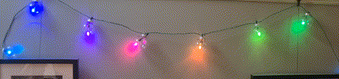

# fairylights

This is just a few functions that make nice patterns.
You can make your own lights, like me, with WS2812B LEDs. Or go on ebay, and buy a pre-made set: search for WS2812, WS2811 or SK6812: there are a lot of options.
The `neopixel` library works on a Raspberry Pi.
